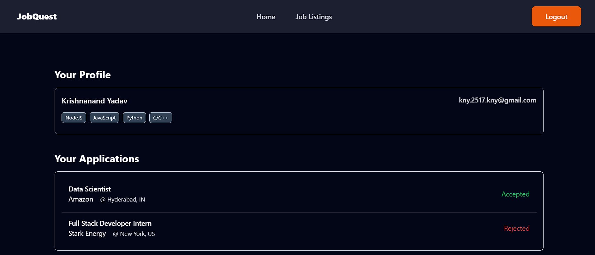
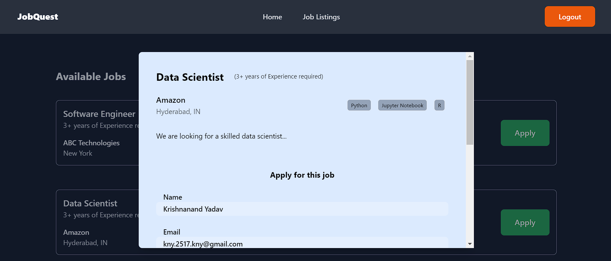
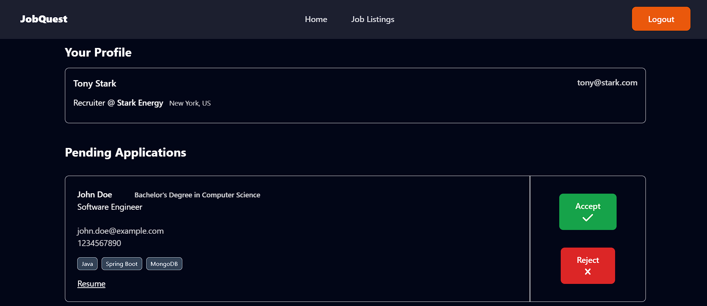

# JobQuest

JobQuest is a 'Job Portal' web application made using Java SpringBoot and ReactJS.

## Table of Contents

- [Demo](#demo)
  - [Screenshots](#screenshots)
- [Features](#features)
- [Technologies Used](#technologies-used)
- [Running the Project Locally](#running-the-project-locally)

## Demo

You can check out the live demo of JobQuest [here](https://job-quest-client.vercel.app/).

### Screenshots

---

---

## Features

- Candidates can
  - apply to posted jobs
  - keep a watch on their job applications' status
- Recruiters can
  - post and delete jobs
  - accept or reject job applications from candidates

## Technologies Used

### Frontend

- [React](https://react.dev/)
- [TailwindCSS](https://tailwindcss.com/) for styling
- [Axios](https://axios-http.com/docs/intro)
- [Redux Toolkit (RTK)](https://redux-toolkit.js.org/)
- [Redux Persist](https://redux-toolkit.js.org/rtk-query/usage/persistence-and-rehydration)

### Backend

- [Spring Boot](https://spring.io/projects/spring-boot)
- [Spring Security](https://spring.io/projects/spring-security)
- [Spring Data MongoDB](https://spring.io/projects/spring-data-mongodb)

### Prerequisites

- [Node.js version 18.15.0 (or higher)](https://nodejs.org)
- [JDK (Java Development Kit) 17](https://www.oracle.com/in/java/technologies/downloads/#java17)
- [Maven](https://maven.apache.org/download.cgi)
